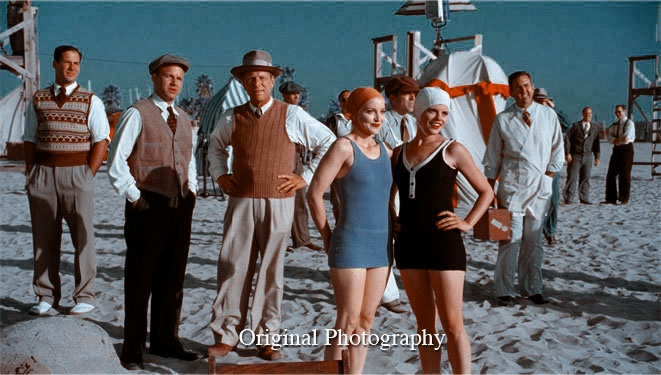

# Technicolor #

Experiment to imitatate old 2-strip and 3-strip technicolor films from regular RGB images. For simplicity of experiment code was written as C# plugins for Paint.NET editor, due to this there is no any build files.

## Examples ##

Here are examples how algorithm works. Images are taken from Aviator movie wich had used similar approach to emulate 2/3-strip technicolor films in their postproduction. Saturation is different on images, due to movie color grading. 

### 2 strip ###

**Original shot**

**Movie**

**Plugin**

### 3 strip ###

**Original shot**

**Movie**

**Plugin**

# License

Use code under MIT license.